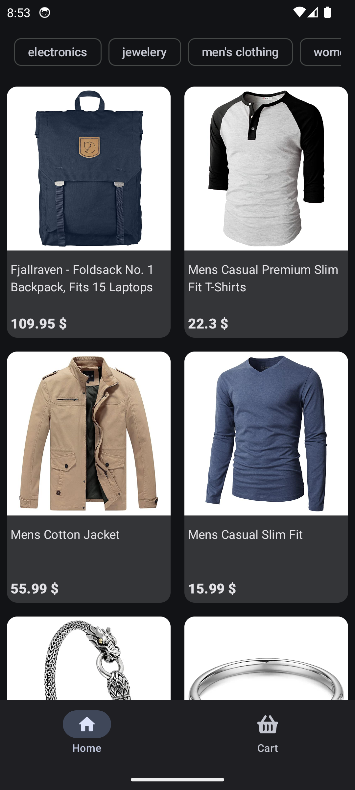
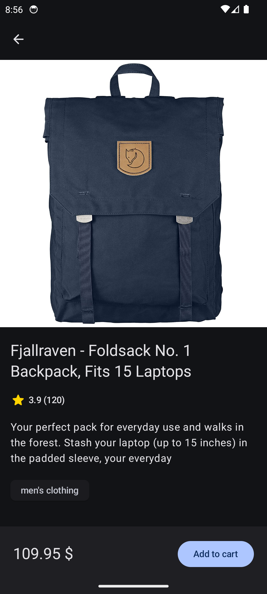
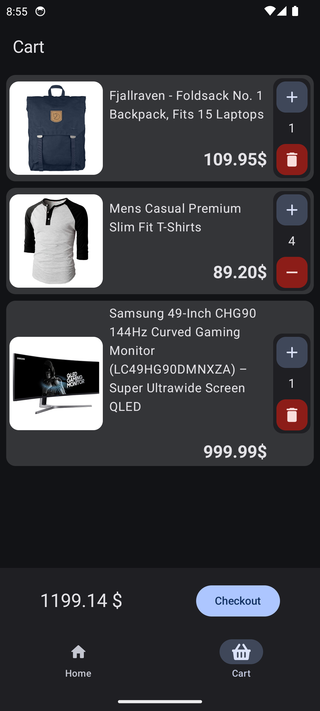

# 🛍️ Shopping Center App

A prototype of a shopping center

<!-- [](https://opensource.org/licenses/MIT) -->

[](https://android-arsenal.com/api?level=21)

## 📖 About The Project

This project is a prototype for an E-commerce Android application. It showcases basic features using sample data and is built following the latest Material Design 3 guidelines for a clean and modern user interface.


---

## ✨ Features

* **Product Catalog:** Browse products by category, search, and filter.
* **Product Details:** View detailed information, images, and reviews for each product.
* **Shopping Cart:** Add, remove, and update product quantities in the cart.

## :bulb: TODO
* **User Authentication:** Secure sign-up and login functionality.
* **Wishlist:** Save favorite items to a wishlist for later.
* **User Profile:** Manage personal information, shipping addresses, and payment methods.

---

## 📸 Screenshots

| **Product Catalog** | **Product Detail** | **Shopping Cart** | 
| :----------: | :----------: | :----------: |
| |  |  |  

---

## 🛠️ Technologies Used

This project is built using the following technologies and architectural patterns:

* **[Kotlin](https://kotlinlang.org/)** as the primary programming language.
* **[Clean Architecture](https://developer.android.com/topic/architecture)** as the architectural pattern.
* **[Jetpack Compose](https://developer.android.com/jetpack/compose)** for building the user interface.
* **[Coroutines](https://kotlinlang.org/docs/coroutines-overview.html)** for asynchronous programming.
* **[Retrofit](https://square.github.io/retrofit/)** for networking and consuming RESTful APIs.
* **[Room](https://developer.android.com/training/data-storage/room)** for local database storage.
* **[Dagger Hilt](https://dagger.dev/hilt/)** for dependency injection.
* **[Glide](https://github.com/bumptech/glide)** for image loading.
* **[Valentinilk Compose Shimmer](https://github.com/valentinilk/compose-shimmer)** for showing shimmer effect for loading objects.
* **[Raamcosta Compose Destinations](https://github.com/raamcosta/compose-destinations)** for type-safe Jetpack Compose navigation

---

## ⚙️ Installation

To get a local copy up and running, please follow these simple steps.

### Prerequisites

* Android Studio IDE
* Android SDK

### Setup

1.  Clone the repo
    ```sh
    git clone [https://github.com/amirkazemzade/shopping_center.git](https://github.com/amirkazemzade/shopping_center.git)
    ```
2.  Open the project in Android Studio.
3.  Build and run the app

---

## 🤝 Contributing

Contributions are what make the open-source community such an amazing place to learn, inspire, and create. Any contributions you make are **greatly appreciated**.

If you have a suggestion that would make this better, please fork the repo and create a pull request. You can also simply open an issue with the tag "enhancement".

1.  Fork the Project
2.  Create your Feature Branch (`git checkout -b feature/AmazingFeature`)
3.  Commit your Changes (`git commit -m 'Add some AmazingFeature'`)
4.  Push to the Branch (`git push origin feature/AmazingFeature`)
5.  Open a Pull Request

---

<!-- ## 📜 License

Distributed under the MIT License. See `LICENSE` for more information.

--- -->

## 📬 Contact

[Amir Kazemzade](https://github.com/amirkazemzade) - amirkazemzade@gmail.com

Project Link: [https://github.com/amirkazemzade/shopping_center](https://github.com/amirkazemzade/shopping_center)

---
